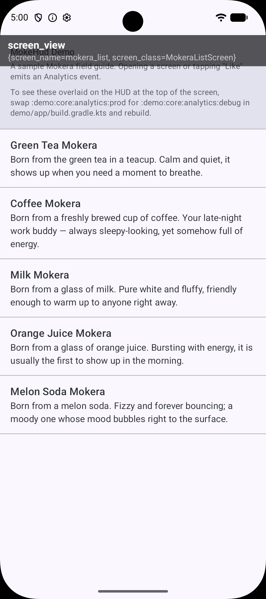

# MokeHud Android

English | [日本語](README.ja.md)

A debug-time HUD library that overlays Analytics events (and similar) on top of your running
app's screen.

Just add `:hud` to your dependencies and the HUD is live — **no `Application` subclass
required**: a manifest-declared `ContentProvider` initializes it automatically.



## Installation

`:hud` is distributed through a Maven repository hosted on GitHub Pages (no authentication
needed).

```kotlin
// settings.gradle.kts
dependencyResolutionManagement {
    repositories {
        google()
        mavenCentral()
        maven { url = uri("https://mokelab.github.io/moke-hud-android/") }
    }
}
```

```kotlin
// build.gradle.kts of your app module
dependencies {
    implementation("com.mokelab.hud:hud-android:0.1.1")
}
```

## Releasing (for maintainers)

The `gh-pages` branch is served as the Maven repository. Artifacts are written into the local
git worktree `.gh-pages/` (already in `.gitignore`), then committed and pushed.

First time only:

```bash
git worktree add --orphan -b gh-pages .gh-pages
(cd .gh-pages && touch .nojekyll && git add .nojekyll \
  && git commit -m "chore: init gh-pages maven repo" && git push -u origin gh-pages)
```

Then, in the repository's Settings → Pages, set **Source = `gh-pages` / `/ (root)`**.

For each release:

```bash
# 1. Bump `version` in hud/build.gradle.kts
git -C .gh-pages pull
./gradlew :hud:publish            # writes the Maven layout into .gh-pages/
git -C .gh-pages add -A
git -C .gh-pages commit -m "publish com.mokelab.hud:hud-android:<version>"
git -C .gh-pages push
```

## Modules

- **`:hud`** — the library itself (`com.mokelab.hud.android`). This is what gets published.
- **`:demo:app`** — a sample app for trying the HUD out, wired up with
  `implementation(project(":hud"))`. It is a multi-module setup with
  `:demo:core:analytics:*` and `:demo:feature:mokera:*`; the entire demo lives under `:demo:`,
  keeping `:hud` — the product — at the top level.

See [`CLAUDE.md`](CLAUDE.md) for the build and test commands used during development.
